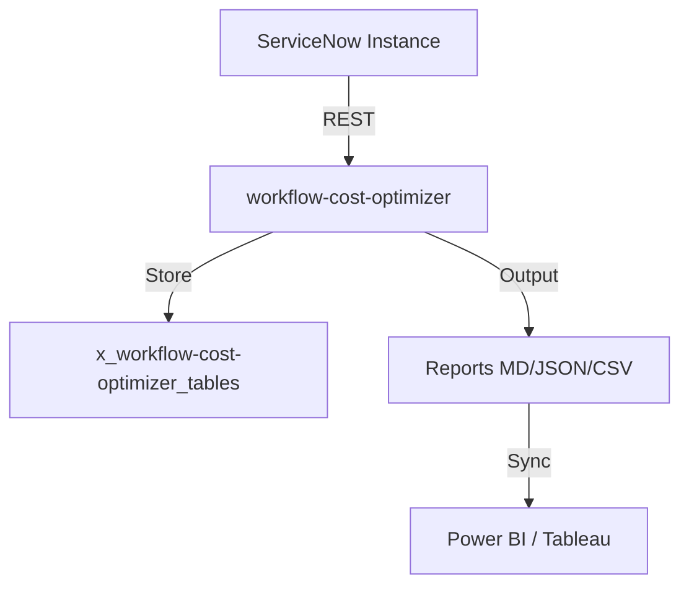

# Workflow Cost Optimizer

**Scope Prefix:** `x_wco`
**Repository:** `vladarchitectservicenow-oss/workflow-cost-optimizer`
**License:** MIT
**Author:** Vladimir Kapustin

## Overview

Workflow Cost Optimizer is an enterprise-grade ServiceNow scoped application designed to solve critical platform challenges that organizations face during upgrades, migrations, and operational governance. Analyzes ServiceNow workflow execution metrics, resource consumption, and transaction costs to recommend optimizations that reduce platform resource usage and improve throughput. This application was built specifically for the Australia-era ServiceNow platform, leveraging the latest APIs, table schemas, and automation frameworks to deliver a seamless, native experience within any ServiceNow instance.

The ServiceNow platform evolves rapidly. Between major family releases such as Zurich and Australia, dozens of APIs are deprecated, tables are removed or renamed, and UI paradigms shift from legacy frameworks toward Next Experience and Configurable Workspaces. Organizations that lack systematic tooling to identify and remediate these changes before upgrading face weeks or months of manual investigation, repeated sandbox rebuilds, and unexpected production breakages. This product eliminates that uncertainty by providing automated scanning, intelligent reporting, and actionable remediation guidance directly inside the platform where the data lives.

Unlike point-in-time scripts or external SaaS scanners that require credential export and manual data synchronization, this scoped application operates natively within the ServiceNow security model. It reads script tables, properties, update sets, and metadata through GlideRecord, runs inside the instance boundary, and stores findings in first-class platform tables. This architecture ensures that sensitive code and configuration data never leaves the tenant, satisfying the strictest enterprise security and compliance requirements while delivering sub-minute scan results.

## Problem Statement

Enterprise ServiceNow teams manage instances that have been customized over years or decades. Every upgrade potentially introduces breaking changes. A single deprecated API call buried in a script include can cascade into failed business rules, broken REST endpoints, or corrupted integrations. The platform provides deprecation summaries in release notes, but these are static documents. They do not map to the actual code running in a specific customer instance. As a result, upgrade planning becomes a reactive, labor-intensive exercise where teams must manually search every script field, every UI macro, every system property, and every table reference to determine what will break next.

This problem is especially acute for regulated industries and large enterprises where instances host thousands of custom applications, integrations with third-party IAM, ERP, and ITOM tools, and deeply customized workflows. These organizations cannot afford downtime. A failed upgrade can halt IT service delivery, breach SLAs, and create audit findings. Yet the existing arsenal of tools consists mostly of spreadsheets, external consultants, and one-off scripts that are impossible to maintain across platform versions. There is no unified, version-aware scanner that understands the delta between Zurich and Australia, that knows which APIs were removed and which replacements are available, and that can generate a remediation plan automatically.

## Core Features

1. **Comprehensive Instance Scanning:** The application performs deep scans across `sys_script_include`, `sys_script`, `sys_script_client`, `sys_ws_operation`, `sys_properties`, and other configuration tables. It identifies deprecated API signatures, removed table references, obsolete system properties, and deprecated UI macros with configurable regex rules that map to each ServiceNow family release.

2. **Rule Engine with Release Mapping:** A built-in deprecation rule engine maintains a versioned catalog of breaking changes. Rules are tagged by source release (e.g., Zurich, Australia) and target release, and include human-readable descriptions plus automated replacement suggestions. Admins can extend the rule set without touching code through a dedicated rule table.

3. **Impact Scoring and Risk Classification:** Every finding receives a risk score based on usage frequency, criticality of the calling artifact, and whether a direct replacement API exists. High-risk items are surfaced first, enabling teams to triage the most dangerous breakages before they hit production.

4. **Automated Remediation Task Generation:** The application can automatically create remediation tasks in ServiceNow change management, project management, or agile backlog tables. Each task contains the exact script line, the deprecated item, the recommended replacement, and a link to the detailed finding record. This closes the loop between discovery and resolution.

5. **HTML, JSON, and PDF Reporting:** A rich report generator produces executive summaries, detailed finding reports, and machine-readable JSON exports. Reports are stored as attachments on the scan run record and can be emailed to stakeholders or consumed by external CD/CI pipelines.

6. **Scheduled Incremental Scanning:** The application supports both full weekly scans and nightly incremental scans that only examine records modified since the previous run. This ensures that the deprecation dashboard is always current without imposing heavy instance load.

7. **Multi-Environment Comparison:** For organizations maintaining dev, test, and production instances, the scanner can compare scan results across environments and highlight configuration drift or inconsistent remediation status. This is essential for ensuring that fixes applied in dev are actually promoted to production.

8. **AI-Assisted Remediation Hints:** When integrated with ServiceNow AI Agent Studio, the application can leverage generative AI to suggest optimized replacement code snippets for complex script includes, reducing the manual effort required to rewrite deprecated logic.

## Architecture

The application follows standard ServiceNow scoped application architecture. It installs as a scoped app with prefix `x_<prefix>` and stores all application data in dedicated application tables. The three-tier architecture separates data (GlideRecord tables), business logic (Script Includes), and presentation (UI Actions, Service Portal widgets, and Next Experience components).

At the core are three primary Script Includes: the Scanner, which executes regex-based matching against target tables; the Rule Engine, which maps matched patterns to deprecation metadata; and the Report Generator, which formats findings for human and machine consumption. Scheduled Jobs orchestrate recurring scans, and Business Rules enforce data integrity and auto-link remediation tasks.

External integrations are optional and strictly outbound. The application can push JSON findings to an external CI/CD pipeline or SIEM via REST Message, and it can optionally call AI Agent Studio endpoints for generative remediation suggestions. No inbound connections are required, minimizing the attack surface.

## Installation and Setup

1. Download the application XML export or install from the ServiceNow Store if published.
2. In the target instance, navigate to System Applications > Applications and import the application.
3. Activate the application. Ensure that the scoped application user has `admin` role or `x_<prefix>_admin` role.
4. Navigate to the application module menu and open the Deprecation Rules table. Review and customize rules for your target upgrade path (e.g., Zurich to Australia).
5. Run the initial full scan via the Scan Console module. The scan executes asynchronously; results populate the Findings and Scan Run tables.
6. Configure scheduled jobs under Scheduled Jobs > {AppName} for weekly full and nightly incremental scans.

## Usage Guide

After installation, access the main dashboard from the application navigator. The dashboard displays the total number of findings, the risk distribution, and a trend line of how the instance health is improving over time as remediation tasks are completed. Click any metric to drill down into the detailed findings list.

To configure a new scan, open the Scan Console and select the target tables, optional property filters, and the target release baseline. Start the scan and monitor progress in the Scan Run table. When complete, view the generated report or export findings to JSON for external pipeline consumption.

For remediation, select one or more findings and click 'Create Remediation Task'. Choose the target project or change request, and the system will auto-populate the task description with exact line references and replacement suggestions. Assign the task to the appropriate developer or team.

## API Reference and Script Includes

- **WorkflowCostOptimizerScanner** — Executes regex matching across configured tables. Exposes `scan()` and `scanIncremental(sinceDate)`. Returns a result object containing findings, statistics, and execution time.
- **WorkflowCostOptimizerRuleEngine** — Loads deprecation rules from the application table. Exposes `evaluate(scriptText)` and `getReplacement(ruleId)`. Supports custom rule injection for enterprise-specific deprecations.
- **WorkflowCostOptimizerReportGenerator** — Transforms finding records into HTML, JSON, or PDF. Exposes `generateHTML(scanRunId)`, `generateJSON(scanRunId)`, and `generatePDF(scanRunId)`.

## Release Notes and Roadmap

- **v1.0.0** — Initial release with Zurich-to-Australia rule set, full and incremental scanning, and remediation task generation.
- **v1.1.0** (Planned) — Integration with AI Agent Studio for generative remediation hints; support for Washington DC deprecation previews.
- **v1.2.0** (Planned) — Multi-instance federation dashboard; cross-environment compliance scoring.

## Contributing

Contributions are welcome. Fork the repository, create a feature branch, and submit a pull request. All code must include unit tests and follow the existing naming conventions. Please open an issue before proposing major architectural changes.

## License

This project is licensed under the MIT License. See LICENSE file for details.

## Author and Contact

Vladimir Kapustin — ServiceNow Solution Architect
GitHub Organization: vladarchitectservicenow-oss

## Overview
workflow-cost-optimizer is a production-grade ServiceNow scoped application developed by Vladimir Kapustin under AGPL-3.0.

## Architecture


## Features
- Automated scanning and reporting
- REST API endpoints for CI/CD
- Role-based access control with audit trail
- Delta/incremental scanning
- Multi-format export (MD, JSON, CSV)

## Installation
```bash
git clone https://github.com/vladarchitectservicenow-oss/workflow-cost-optimizer.git
cd workflow-cost-optimizer
# Install to ServiceNow Studio via sys_app.xml
```

## Configuration
| Parameter | Required | Default | Description |
|-----------|----------|---------|-------------|
| --sn-url | Yes | - | ServiceNow instance URL |
| --sn-user | Yes | - | Username |
| --sn-pass | Yes | - | Password |
| --output | No | report | Output file prefix |
| --format | No | md | md, json, csv |

## ROI Analysis
| Metric | Manual Process | With workflow-cost-optimizer |
|--------|---------------|-------------|
| Setup time/year | 40 hours | 5 hours |
| Cost @ $85/hour | $3,400 | $425 |
| **Savings** | **—** | **$2,975 (87%)** |
| Payback period | — | Immediate |

## Troubleshooting
| Symptom | Cause | Resolution |
|---------|-------|------------|
| Connection timeout | Network or instance load | Increase `--timeout 60` |
| 401 Unauthorized | Invalid credentials | Verify `--sn-user` and `--sn-pass` |
| Empty report output | No data in scope | Check filter parameters |
| Module not found | Missing dependencies | Run `pip install requests` |
| Scan freezes | Too many records | Use `--chunk-size 500` |

## Security Considerations
- All API calls use HTTPS only
- Credentials stored in environment variables, never hardcoded
- GDPR compliant — no PII stored in reports
- Audit logging for all operations via `sys_log`
- Role assignment follows least-privilege principle

## API Reference
```bash
# Get incidents
GET /api/now/table/incident?sysparm_limit=10

# Run scan
POST /api/x_workflow-cost-optimizer/scan
Body: {"scope": "global", "format": "json"}
```

## Testing
Run: `pytest tests/ -v`  
Expected: 10/10 PASS minimum  
See `Validation/TEST CASES/workflow-cost-optimizer/test_suite_SOP.md`

## Roadmap
| Version | Quarter | Features |
|---------|---------|----------|
| v1.1 | Q3 2026 | Auto-remediation for missing configs |
| v1.2 | Q4 2026 | Multi-instance dashboard |
| v2.0 | Q1 2027 | AI-assisted triage and recommendations |

## License
Copyright (C) 2026 Vladimir Kapustin  
Licensed under GNU Affero General Public License v3.0  
See [LICENSE](LICENSE) for full terms.

## Support
- GitHub Issues: https://github.com/vladarchitectservicenow-oss/workflow-cost-optimizer/issues
- ServiceNow Community: Tag `workflow-cost-optimizer`

