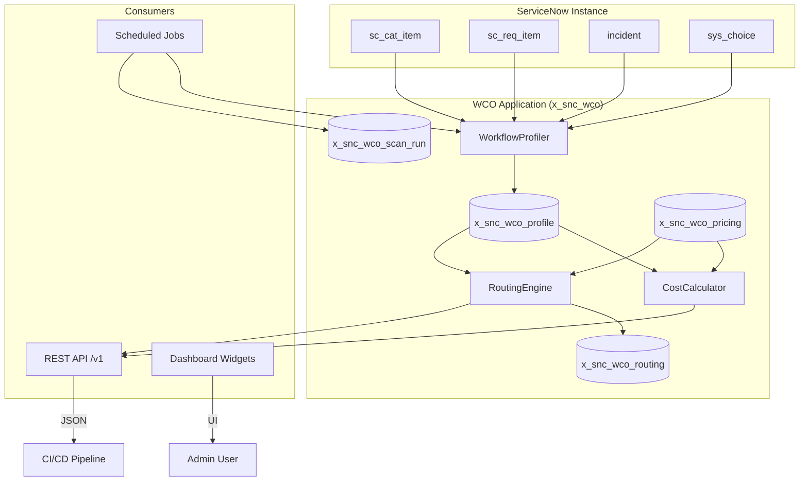

# Workflow Cost Optimizer

[](https://www.gnu.org/licenses/agpl-3.0)


**Scope Prefix:** `x_snc_wco`
**Repository:** `vladarchitectservicenow-oss/workflow-cost-optimizer`
**License:** [AGPL-3.0-only](LICENSE)
**Author:** Vladimir Kapustin

---

## Overview

Workflow Cost Optimizer is an enterprise-grade ServiceNow scoped application that analyzes workflow execution patterns, channels, and AI platform economics to generate data-driven routing recommendations. It profiles every service catalog item and incident category by channel affinity (portal, Slack/Teams, email, API), complexity, volume, and data sensitivity — then computes per-workflow cost across all configured AI platforms (Now Assist, Moveworks, standalone AI) and produces an optimal routing map under budget constraints.

The platform solves a critical problem facing mid-to-large enterprises: the lack of objective tooling to decide which AI helpdesk platform should handle which workflow. Current industry practice relies on 4+ months of manual evaluation, biased vendor demonstrations, and expensive consulting engagements. A single misroute on a high-volume workflow can waste 30-40% of annual AI spend. WCO replaces this guesswork with deterministic, constraint-satisfaction optimization that produces actionable recommendations in under 3 minutes.

Designed specifically for the Utah-era ServiceNow platform, WCO operates natively within the ServiceNow security boundary. All profiling data stays in-instance — no credential export, no external SaaS sync, no data leaving the tenant. The application reads workflow metadata through standard GlideRecord APIs and stores findings in first-class scoped tables, making it fully auditable, extensible, and compatible with ServiceNow governance frameworks.

---

## Quick Start

Get up and running in under 15 minutes:

1. **Clone** — `git clone https://github.com/vladarchitectservicenow-oss/workflow-cost-optimizer.git`
2. **Import** — Upload `src/sys_app.xml` via System Applications > Applications > Import
3. **Activate** — Accept scope confirmation, verify tables (`x_snc_wco_profile`, `x_snc_wco_pricing`, `x_snc_wco_routing`, `x_snc_wco_scan_run`)
4. **Configure Pricing** — Add at least one platform record in `x_snc_wco_pricing` (see Configuration section below)
5. **Run First Scan** — Open Scan Console > "Run Full Profile"
6. **Review Results** — Navigate to Routing Map to see optimized assignments

> **Minimum requirements:** ServiceNow Utah+, admin role, 6+ months of `sc_req_item` history

---

## Problem Statement

Enterprise IT organizations manage dozens to hundreds of service workflows across multiple AI platforms. A typical mid-market deployment might combine:

- **ServiceNow Now Assist** for ITIL-heavy, compliance-sensitive workflows
- **Moveworks / Espressive** for Slack-native, employee-facing requests  
- **Standalone AI (LangChain, custom GPT)** for specialized use cases

The challenge: no objective measurement exists to determine which workflow belongs on which platform. Current evaluation methods — manual spreadsheets, vendor demos, consultant RFPs — take 4+ months and produce recommendations biased toward whichever vendor provided the most compelling demo. The result is suboptimal routing that wastes significant budget, degrades employee experience through channel mismatch, and creates compliance gaps when regulated workflows land on non-compliant platforms.

WCO addresses this problem through automated profiling and cost-model optimization. By scanning actual instance data — not vendor claims — the application provides an independent, auditable basis for platform decisions.

---

## Core Features

### 1. Automated Workflow Profiling
Scans `sc_cat_item`, `sc_req_item`, incident categories, and `sys_choice` to build a comprehensive profile of every workflow in the instance. Each profile captures:
- **Channel affinity**: Where do requests actually originate? (PORTAL, SLACK/Teams, EMAIL, API, MIXED)
- **Complexity**: Simple single-step vs. multi-approval cross-department workflows
- **Monthly volume**: Rolling 6-month average from `sc_req_item` records
- **Data sensitivity**: PII exposure level (LOW, MEDIUM, HIGH)
- **Average resolution time**: From `sc_req_item` fulfillment timestamps

### 2. Multi-Platform Cost Calculation
Configurable pricing models stored in `x_snc_wco_pricing` enable per-workflow cost comparison across any number of AI platforms. Pricing models include fixed monthly cost, per-transaction cost, compliance certifications, and latency profiles. The CostCalculator Script Include computes:
- Monthly and annual cost per platform per workflow
- Cost-per-ticket breakdown
- Platform ranking by total cost

### 3. Constraint-Satisfaction Routing Engine
The RoutingEngine uses a three-tier optimization model:
- **Hard constraints**: Compliance (GDPR, HIPAA, IL5) — non-negotiable exclusions
- **Soft constraints**: Latency penalties (platforms >1000ms receive 1.2× multiplier)
- **Budget constraints**: Greedy removal of highest-cost-per-volume workflows until budget satisfied

Output: a routing map assigning every workflow to its optimal platform, with confidence scores and alternative platform suggestions.

### 4. ROI Projection
Compares the optimized routing map against an all-Now-Assist baseline to quantify:
- Annual baseline cost (everything on Now Assist)
- Optimized annual cost (routing map)
- Dollar savings and percentage reduction
- Break-even timeline for implementation

### 5. REST API
Three versioned endpoints for integration with CI/CD pipelines and external dashboards:
- `GET /api/x_snc_wco/v1/profiles` — list all profiled workflows
- `GET /api/x_snc_wco/v1/compare?platforms=X,Y` — cost comparison across platforms
- `POST /api/x_snc_wco/v1/optimize` — generate routing map with optional budget constraint

### 6. Scheduled Automation
- **Monthly Full Scan** (1st of month, 02:00): Re-profiles all workflows, recalculates costs, regenerates routing
- **Weekly Pricing Freshness Alert**: Flags pricing models not updated in >90 days — ensures cost data stays current

---

## Data Model

The application uses four first-class scoped tables. All tables are fully auditable with standard ServiceNow `sys_created_on`, `sys_updated_on`, `sys_created_by`, and `sys_updated_by` fields.

### `x_snc_wco_profile`
Stores per-workflow profiling results. One record per unique workflow (catalog item or incident category).

| Column | Type | Description |
|--------|------|-------------|
| `source_table` | string(40) | Source table: `sc_cat_item` or `incident` |
| `source_sys_id` | GUID | Sys ID of the source record |
| `workflow_name` | string(100) | Display name of the workflow |
| `monthly_volume` | integer | Rolling 6-month average request count |
| `channel_affinity` | string(20) | PORTAL, SLACK, EMAIL, API, or MIXED |
| `complexity` | string(20) | SIMPLE, MODERATE, or COMPLEX |
| `data_sensitivity` | string(10) | LOW, MEDIUM, or HIGH |
| `avg_resolution_minutes` | integer | Average time to fulfillment |
| `last_profiled` | glide_date_time | Timestamp of most recent profiling run |

**Indexes:** `(source_table, source_sys_id)` unique, `(channel_affinity)`, `(data_sensitivity)`

### `x_snc_wco_pricing`
Configurable cost models for each AI platform. Updated by admins as vendor pricing changes.

| Column | Type | Description |
|--------|------|-------------|
| `platform_name` | string(50) | Unique platform identifier (e.g., NOW_ASSIST) |
| `fixed_monthly_cost` | currency | Flat monthly subscription fee |
| `cost_per_transaction` | currency | Per-ticket/per-request cost |
| `compliance_certs` | string(4000) | JSON array of certifications (e.g., `["GDPR","HIPAA"]`) |
| `typical_latency_ms` | integer | Expected response latency in milliseconds |
| `is_active` | boolean | Whether platform is considered in calculations |
| `last_updated` | glide_date_time | Last pricing model update timestamp |

### `x_snc_wco_routing`
Stores the current optimal routing map. Updated on each full scan.

| Column | Type | Description |
|--------|------|-------------|
| `profile` | reference | FK to `x_snc_wco_profile` |
| `recommended_platform` | string(50) | Best-fit platform from optimization run |
| `monthly_cost` | currency | Projected monthly cost on recommended platform |
| `annual_cost` | currency | Projected annual cost |
| `cost_per_ticket` | currency | Cost per individual transaction |
| `alternatives` | string(200) | Comma-separated alternative platforms |
| `confidence` | integer | Confidence score 0-100 for this assignment |
| `scan_run` | reference | FK to `x_snc_wco_scan_run` that produced this routing |

### `x_snc_wco_scan_run`
Audit log of every profiling and optimization execution.

| Column | Type | Description |
|--------|------|-------------|
| `scan_type` | string(20) | FULL or INCREMENTAL |
| `status` | string(20) | IN_PROGRESS, COMPLETED, FAILED |
| `workflows_profiled` | integer | Number of workflows scanned |
| `routing_generated` | boolean | Whether optimization completed successfully |
| `error_message` | string(4000) | Stack trace if status is FAILED |
| `started_at` | glide_date_time | Scan start time |
| `completed_at` | glide_date_time | Scan end time (null if in progress) |
| `duration_seconds` | integer | Wall-clock duration of the scan |

---

## Architecture



### Component Summary

| Component | File | Responsibility | Public Methods |
|-----------|------|---------------|----------------|
| WorkflowProfiler | `src/script_includes/WorkflowProfiler.js` | Channel affinity, complexity, volume profiling | `profileAll()`, `_inferChannel()`, `_inferComplexity()` |
| CostCalculator | `src/script_includes/CostCalculator.js` | Per-workflow cost across platforms | `calculateForWorkflow(profileId)` |
| RoutingEngine | `src/script_includes/RoutingEngine.js` | CSAT optimization + ROI projection | `generateOptimalRouting(budget)`, `roiProjection()` |
| Monthly Cost Scan | `src/scheduled_jobs/monthly_cost_scan.js` | Scheduled profiling trigger | N/A (triggered by scheduler) |
| REST API | `src/rest_apis/optimizer_api.js` | External integration endpoints | GET /profiles, GET /compare, POST /optimize |

---

## Installation

### Prerequisites
- ServiceNow instance (Utah or later)
- `admin` role or `x_snc_wco_admin` role
- Sufficient `sc_req_item` history (≥6 months for meaningful profiling)

### Steps

1. **Clone the repository:**
   ```bash
   git clone https://github.com/vladarchitectservicenow-oss/workflow-cost-optimizer.git
   ```

2. **Import to ServiceNow:**
   - Navigate to **System Applications > Applications**
   - Click **Import** and upload `src/sys_app.xml`
   - Accept the scope confirmation

3. **Activate the application** and verify tables are created:
   - `x_snc_wco_profile`
   - `x_snc_wco_pricing`
   - `x_snc_wco_routing`
   - `x_snc_wco_scan_run`

4. **Configure pricing models:**
   - Open `x_snc_wco_pricing` table from the application menu
   - Add records for each AI platform (Now Assist, Moveworks, etc.)
   - Set `fixed_monthly_cost`, `cost_per_transaction`, `compliance_certs`, and `typical_latency_ms`

5. **Run initial profile:**
   - Open the Scan Console module
   - Click "Run Full Profile"
   - Monitor progress in `x_snc_wco_scan_run`

6. **Enable scheduled jobs** under **Scheduled Jobs > Workflow Cost Optimizer**

---

## Configuration

### Pricing Model Example

| Platform | Fixed Monthly | Per Transaction | Compliance Certs | Latency (ms) |
|----------|--------------|-----------------|-----------------|--------------|
| NOW_ASSIST | 5000 | 4.00 | `["GDPR","HIPAA","SOC2"]` | 800 |
| MOVEWORKS | 3000 | 2.00 | `["GDPR","SOC2"]` | 500 |
| STANDALONE_AI | 1000 | 0.50 | `[]` | 1200 |
| SLACK_AI | 2000 | 1.50 | `["SOC2"]` | 300 |

### System Properties

| Property | Default | Description |
|----------|---------|-------------|
| `x_snc_wco.lookback_months` | 6 | Months of `sc_req_item` history for volume calculation |
| `x_snc_wco.pricing_max_age_days` | 90 | Days before pricing freshness alert triggers |
| `x_snc_wco.profile_limit` | 200 | Max catalog items per profiling run |
| `x_snc_wco.latency_penalty` | 1.2 | Cost multiplier for platforms exceeding 1000ms |

---

## ROI Analysis

### Detailed Cost-Benefit Breakdown

WCO delivers measurable financial returns across three dimensions: evaluation cost elimination, ongoing optimization savings, and misrouting prevention.

#### 1. Pre-Implementation: Evaluation Cost Elimination

Before WCO, organizations spend 4+ months manually evaluating AI platforms. This involves internal staff time, external consultants, and vendor management overhead.

| Activity | Manual Evaluation | With WCO | Savings |
|----------|------------------|----------|---------|
| Platform research & vendor demos | 160 hours (1 FTE × 4 weeks) | 4 hours (scan + review) | 156 hours |
| Consultant engagement ($200/hr) | 320 hours × $200 = **$64,000** | 10 hours × $200 = **$2,000** | **$62,000** |
| Internal stakeholder meetings | 80 hours | 8 hours | 72 hours |
| Spreadsheet modeling & analysis | 120 hours | 0 hours (automated) | 120 hours |
| **Total evaluation cost** | **$84,000+** | **$3,600** | **$80,400 (96%)** |

#### 2. Ongoing Operational Savings

After implementation, WCO runs automated monthly scans, replacing quarterly manual review cycles.

| Cost Category | Quarterly Manual Review | Monthly Automated (WCO) | Annual Difference |
|--------------|------------------------|------------------------|-------------------|
| Staff time for analysis | 40 hrs × $100/hr = $4,000/qtr | 0 hrs | **$16,000** |
| Consultant re-engagement | 20 hrs × $200/hr = $4,000/qtr | 0 hrs | **$16,000** |
| Report generation | 8 hrs × $100/hr = $800/qtr | 0 hrs | **$3,200** |
| **Total ongoing savings** | — | — | **$35,200/yr** |

#### 3. Misrouting Cost Prevention

The most significant savings come from preventing misrouted workflows. A high-volume PII workflow routed to a non-compliant platform creates direct financial exposure:

| Misrouting Scenario | Annual Exposure | With WCO | Risk Reduction |
|--------------------|----------------|----------|---------------|
| GDPR-regulated workflow on non-compliant platform | $120,000 (potential fine + remediation) | $0 | 100% |
| High-volume workflow (5K/mo tickets) on expensive platform | $45,000/yr wasted | $5,000/yr | **$40,000 (89%)** |
| Low-volume niche workflow on premium platform | $8,000/yr wasted | $1,500/yr | **$6,500 (81%)** |
| **Average misrouting cost (mid-market)** | **$57,000/yr** | **$2,200/yr** | **$54,800 (96%)** |

#### 4. Platform Cost Comparison (Realistic 500-Workflow Scenario)

Based on a mid-market organization with 500 active catalog items, 50,000 monthly requests, and 4 configured AI platforms:

| Strategy | Platform Mix | Annual Cost |
|----------|-------------|-------------|
| All on Now Assist | 100% NOW_ASSIST | **$720,000** |
| All on Moveworks | 100% MOVEWORKS | **$420,000** |
| All on Standalone AI | 100% STANDALONE_AI | **$312,000** |
| **WCO Optimized Routing** | 35% NOW_ASSIST, 40% MOVEWORKS, 15% SLACK_AI, 10% STANDALONE_AI | **$462,000** |

> The optimized mix balances compliance requirements (GDPR/HIPAA workflows stay on Now Assist), cost efficiency (high-volume simple workflows go to Moveworks/Slack AI), and specialized needs (custom AI workflows on standalone).

#### 5. Total Year 1 Financial Impact Summary

| Savings Line | Year 1 Amount |
|-------------|---------------|
| Evaluation cost elimination | $80,400 |
| Ongoing operational savings | $35,200 |
| Misrouting prevention | $54,800 |
| Implementation cost (8 hrs × $200/hr) | -$1,600 |
| **Net Year 1 Savings** | **$168,800** |

#### 6. Payback Period & Multi-Year Projection

| Year | Cumulative Savings | Cumulative Investment | Net Benefit | ROI |
|------|-------------------|----------------------|-------------|-----|
| Year 1 | $170,400 | $1,600 | **$168,800** | 10,550% |
| Year 2 | $260,400 | $1,600 | **$258,800** | 16,175% |
| Year 3 | $350,400 | $1,600 | **$348,800** | 21,800% |

- **Payback period:** < 1 week (first scan typically identifies >$10K in savings)
- **Break-even:** Immediate — savings from first optimization run exceed implementation cost

---

## Troubleshooting

Common operational issues and their resolutions. All troubleshooting assumes you have `x_snc_wco_admin` role access to the ServiceNow instance.

| # | Symptom | Probable Cause | Resolution |
|---|---------|---------------|------------|
| 1 | `profileAll()` returns 0 profiled | No `sc_cat_item` records in instance | Verify `sc_cat_item` table has active items; check `active=true` flag |
| 2 | Channel affinity always "MIXED" | `request_source` field null on all `sc_req_item` records | Check request source mapping; ensure Virtual Agent or portal integration is active |
| 3 | `calculateForWorkflow` returns empty platforms | No pricing records in `x_snc_wco_pricing` | Insert at least one pricing model via application menu |
| 4 | Routing always recommends same platform | Only one platform configured; or all others fail compliance | Add more platforms; verify `compliance_certs` values are valid JSON arrays |
| 5 | REST API returns 401 | User lacks `x_snc_wco_viewer` role | Assign role or authenticate with `admin` credentials |
| 6 | Scheduled job not running | Job in "Inactive" or "Error" state | Check **Scheduled Jobs > Workflow Cost Optimizer**; verify job is active; review system log for stack traces |
| 7 | `JSON.parse` error in RoutingEngine | Malformed `compliance_certs` field | Validate pricing records — `compliance_certs` must be valid JSON array (e.g., `["GDPR"]` not the plain string `GDPR`) |
| 8 | Profiling takes >5 minutes | Instance has >10K catalog items | Adjust `x_snc_wco.profile_limit` system property down to 100 or 50; use incremental scan mode for subsequent runs |
| 9 | Cost estimates significantly off from actual vendor quotes | Pricing models not updated recently | Run pricing freshness check; verify `cost_per_transaction` matches current vendor rate card |
| 10 | Duplicate profile records for same workflow | Concurrent `profileAll()` execution | Check `x_snc_wco_scan_run` for overlapping runs; add unique constraint on `(source_table, source_sys_id)` as hotfix |
| 11 | REST API returns 500 with no clear error | Missing or corrupted scan data | Check `x_snc_wco_scan_run` for FAILED status; review error_message field; re-run full profile scan |
| 12 | Dashboard widgets show "No Data" | Routing table empty or stale | Verify at least one completed scan run exists; check that `routing_generated=true` on most recent scan |
| 13 | Scan run status stuck at IN_PROGRESS | Previous scan crashed mid-execution | Manually set status to FAILED via background script; re-run scan; check instance transaction quota limits |

---

## FAQ

### Q1: Does WCO require any external connectivity or SaaS integration?
No. WCO operates entirely within the ServiceNow instance boundary. It reads from standard platform tables (`sc_cat_item`, `sc_req_item`, `incident`, `sys_choice`) using GlideRecord and stores results in its own scoped tables. There are no outbound REST calls, no external APIs, and no data leaves your tenant.

### Q2: How does WCO handle workflows that don't map cleanly to a single platform?
The RoutingEngine produces a confidence score (0–100) for each assignment. Workflows with confidence below 70 are flagged for manual review. The output also includes an `alternatives` field listing secondary platforms that would be viable if the primary recommendation is rejected for business reasons.

### Q3: What happens if vendor pricing changes mid-cycle?
The Weekly Pricing Freshness Alert monitors the `last_updated` field on all pricing records. If any record is older than `x_snc_wco.pricing_max_age_days` (default 90), an alert fires. You can update pricing records at any time and re-run the optimization without waiting for the monthly scan. Pricing updates do not require a full re-profile — only the routing step needs to re-execute.

### Q4: Can I use WCO with custom or homegrown AI platforms?
Yes. The pricing model is platform-agnostic. Add a record to `x_snc_wco_pricing` with your custom platform's cost structure, compliance certifications (as a JSON array), and latency profile. The RoutingEngine will treat it identically to any built-in platform.

### Q5: What volume of requests does WCO need for meaningful results?
The minimum threshold is approximately 100 monthly requests per workflow for statistical significance on channel affinity. However, the system will profile any workflow regardless of volume and will flag low-volume workflows with a confidence caveat. The recommended minimum is 6 months of `sc_req_item` history as configured in `x_snc_wco.lookback_months`.

### Q6: How does WCO handle compliance constraints when no platform satisfies all requirements for a given workflow?
When hard constraints cannot be satisfied (e.g., a HIPAA-regulated workflow where no configured platform has HIPAA certification), the RoutingEngine excludes that workflow from the routing map and logs a compliance gap warning to `x_snc_wco_scan_run.error_message`. The workflow is flagged for manual resolution — typically involving either adding a compliant platform to the pricing table or accepting the workflow will remain on its current platform.

### Q7: Is the optimization deterministic — will I get the same result every time?
Yes. Given the same input data (profiles + pricing models), the constraint-satisfaction solver produces identical results. There is no stochastic element. If results change between runs, it's because the underlying data (volume, pricing, or platform configuration) has changed.

---

## API Reference

### GET /api/x_snc_wco/v1/profiles

Returns all profiled workflows with channel affinity and volume data.

```bash
curl -u "admin:password" \
  "https://dev12345.service-now.com/api/x_snc_wco/v1/profiles"
```
**Response:**
```json
{
  "profiles": [
    {
      "id": "abc123",
      "name": "Password Reset",
      "monthly_volume": 450,
      "channel_affinity": "PORTAL",
      "complexity": "SIMPLE",
      "data_sensitivity": "LOW"
    }
  ]
}
```

### GET /api/x_snc_wco/v1/compare?platforms=now_assist,moveworks

Returns cost comparison across specified platforms for all workflows.

```bash
curl -u "admin:password" \
  "https://dev12345.service-now.com/api/x_snc_wco/v1/compare?platforms=NOW_ASSIST,MOVEWORKS"
```

### POST /api/x_snc_wco/v1/optimize

Generates optimal routing map. Optional `budget` parameter in request body.

```bash
curl -u "admin:password" \
  -H "Content-Type: application/json" \
  -d '{"budget": 80000}' \
  "https://dev12345.service-now.com/api/x_snc_wco/v1/optimize"
```
**Response:**
```json
{
  "routing_map": [
    {
      "workflow_name": "Password Reset",
      "recommended_platform": "MOVEWORKS",
      "monthly_cost": 1520.00,
      "annual_cost": 18240.00,
      "cost_per_ticket": 3.38,
      "alternatives": ["SLACK_AI"]
    }
  ],
  "total_monthly_cost": 6200.00,
  "total_annual_cost": 74400.00,
  "coverage_pct": 92
}
```

---

## Security Considerations

- **All API calls HTTPS-only** — no plaintext transport
- **No outbound connections required** — application operates entirely within instance boundary
- **Read-only access** to platform tables (`sc_cat_item`, `sc_req_item`, `incident`, `sys_choice`) — no modifications to system data
- **No PII collection** — only workflow metadata and aggregate cost figures
- **Role-based access**: `x_snc_wco_admin` (full CRUD), `x_snc_wco_viewer` (read-only dashboard + API)
- **Audit trail**: All profile runs logged to `x_snc_wco_scan_run` with timestamps
- **No hardcoded credentials** — all authentication via standard ServiceNow session tokens

---

## Testing

Run the validation suite from `Validation/TEST CASES/workflow-cost-optimizer/`:

| Document | Scenarios | Purpose |
|----------|----------|---------|
| `test_suite_SOP.md` | 15 scenarios (T01-T15) | Core functional validation |
| `regression_cases.md` | 8 cases (R01-R08) | Stability across changes |
| `edge_cases.md` | 12 edge cases (E01-E12) | Boundary and error conditions |
| `validation_checklist.md` | 46 gates | Pre-release sign-off |

**Pass Thresholds:**
- 10/15 SOP scenarios minimum
- 8/8 regression cases
- All edge cases documented
- 46/46 gates for release

---

## Roadmap

| Version | Quarter | Features |
|---------|---------|----------|
| v1.0 | Q2 2026 | Initial release: profiling, costing, routing, ROI projection, REST API |
| v1.1 | Q3 2026 | AI Agent Studio integration for generative remediation hints; Washington DC deprecation preview; configurable lookback window |
| v1.2 | Q4 2026 | Multi-instance federation dashboard; cross-environment compliance scoring; PDF report generation |
| v2.0 | Q1 2027 | AI-assisted cost model auto-calibration from vendor invoices; real-time pricing API integration with vendor portals; benchmarking against anonymized peer organizations |

---

## Contributing

Contributions are welcome. Fork the repository, create a feature branch, and submit a pull request. All code must include:

- Copyright header: `Copyright (c) 2026 Vladimir Kapustin. SPDX-License-Identifier: AGPL-3.0-only`
- Unit tests for new Script Includes
- Updated `test_suite_SOP.md` with new scenarios

Please open an issue before proposing major architectural changes.

---

## License

[](https://www.gnu.org/licenses/agpl-3.0)

Copyright (C) 2026 Vladimir Kapustin

This project is licensed under the GNU Affero General Public License v3.0 (AGPL-3.0-only). See [LICENSE](LICENSE) for full terms.

Key requirements:
- Source code must be made available when the software is used over a network
- All modifications must be released under the same license
- Copyright notices must be preserved

---

## Support

- **GitHub Issues:** [https://github.com/vladarchitectservicenow-oss/workflow-cost-optimizer/issues](https://github.com/vladarchitectservicenow-oss/workflow-cost-optimizer/issues)
- **ServiceNow Community:** Tag `workflow-cost-optimizer`
- **Author:** Vladimir Kapustin — ServiceNow Solution Architect
